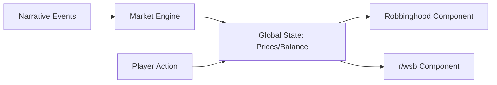

# Architecture Patterns: WallStreetBets Trader Game

**Domain:** UI-Driven Narrative Sim
**Researched:** 2024-05-24

## Recommended Architecture

The game follows a **State-Driven Windowing** architecture. The "Laptop" and "Phone" are the primary containers, with sub-apps (Robbinghood, r/wsb, etc.) as modular React components.

### Component Boundaries

| Component | Responsibility | Communicates With |
|-----------|---------------|-------------------|
| `GameContainer` | Manages global state (Balance, Time, Stocks). | All sub-components. |
| `LaptopView` | Renders the desktop UI and active "Window." | `GameContainer` (State). |
| `PhoneView` | Renders SMS and Forum overlays. | `GameContainer` (State). |
| `MarketEngine` | Calculates stock movement based on narrative events. | `GameContainer` (Updates state). |

### Data Flow



## Patterns to Follow

### Pattern 1: Step-Based Market Progression
Instead of real-time ticks, the market only moves when the player "reads" a forum post or "watches" a video. This gives the player time to process the narrative.
```typescript
const useMarketStep = () => {
  const { setPrices, currentEvents } = useGameState();
  const stepMarket = () => {
    const volatility = currentEvents.reduce((acc, e) => acc + e.impact, 0);
    setPrices(prev => prev.map(s => s * (1 + volatility)));
  };
  return { stepMarket };
};
```

### Pattern 2: Global 4-Color SVG Filter
The entire application is wrapped in a single DOM element that has the `filter: url(#pocket-palette)` applied. This ensures consistent "Game Boy" aesthetics without needing to manually color every component.

## Anti-Patterns to Avoid

### Floating Point Precision for Money
**Why bad:** Financial rounding errors can ruin the "Guh" moment.
**Instead:** Use `cents` (integers) for all money calculations and format for display.

### Unconstrained Resizing
**Why bad:** Pixel art looks blurry if not scaled at integer multiples.
**Instead:** Use a "Viewport Container" that maintains a fixed aspect ratio (e.g., 160x144 scaled by 4x) and centers it on the screen.

## Scalability Considerations

| Concern | Approach |
|---------|----------|
| 100+ Forum Posts | Use a virtualized list for the r/wsb feed to keep performance high under the SVG filter. |
| Complex Price History | Store only the last 50 data points for the "Stonks" line graph. |
| Multi-Endings | Use a simple "Weight" system for ending triggers (Net Worth vs. Karma). |

## Sources

- [React Game Architecture Patterns](https://www.freecodecamp.org/news/how-to-build-a-game-with-react/)
- [Pixel Art UI Scaling](https://medium.com/@beast_and_bird/pixel-perfect-scaling-in-the-browser-2d2c770c1e84)
